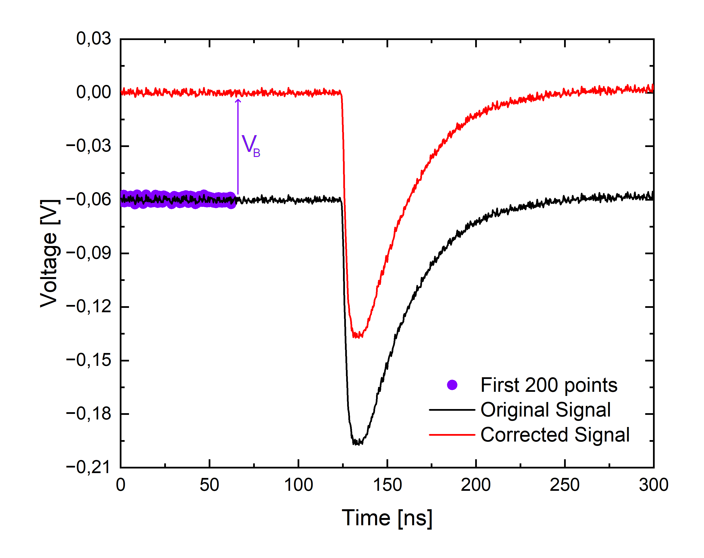
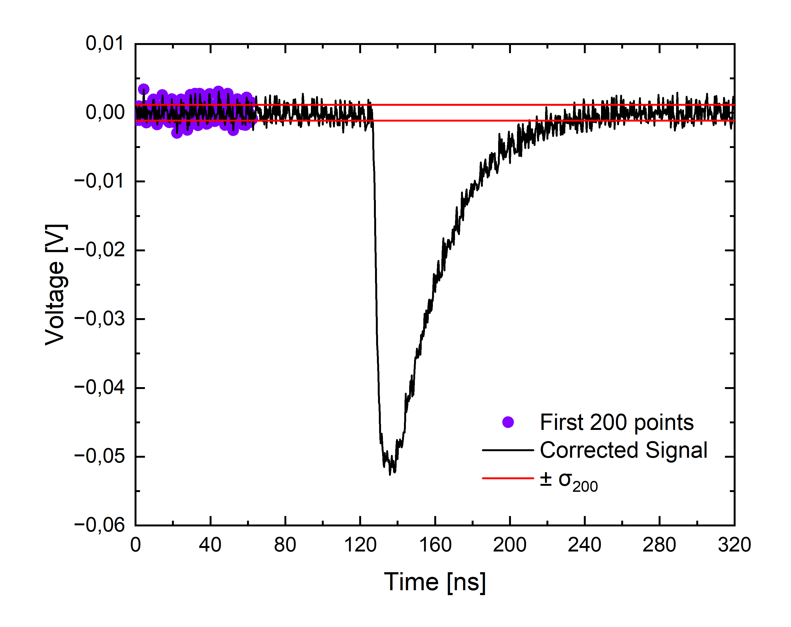
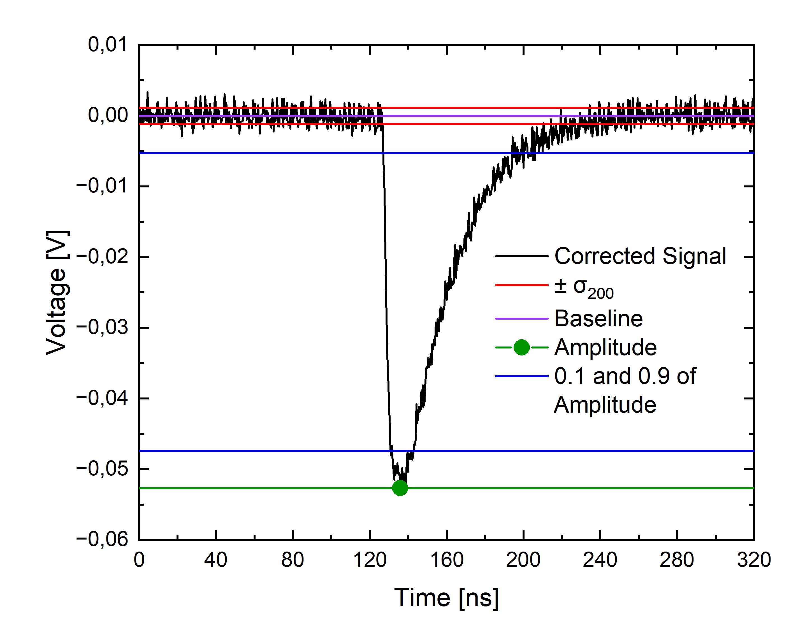
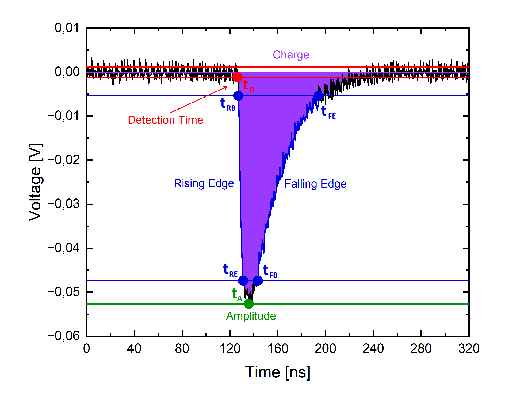

# Study of the effect of temperature fluctuations on the characteristics of a scintillation detector with a silicon photomultiplier

This project is used to analyze data collected using a Caen digitizer DT5743. The analysis consists of:

  - Single signal parameters calculation
  - Cuts based on signal shapes
  - Compton edge position calculation based on charge and amplitude histograms
  - Cuts based on compton edge positions for charges
  - Calculation of the compton edge dependence factor on temperature / voltage
  - Energy and time resolution calculation

## Signal Parameters:
Every collected signal undergo the following procedure:
1. Baseline calculation and signal correction
2. ± σ<sub>200</sub> region calculation
3. Amplitude value and position calculation
4. Calculation of positions of 0.1 and 0.9 of amplitude value
5. Rising and falling edge lenght calculation
6. Detection tinme calculation
7. Charge calculation

The graph below shows an example of the collected signal:
<p align="center">
  
</p>

Baseline **V<sub>B</sub>** is calculated as a aritmetic mean of first 200 voltage values. Then **V<sub>B</sub>** is substracted from every point in a signal. Thanks to that whole signal is shifted by **V<sub>B</sub>** upwards or downwards and the baseline of such corrected signal becomes 0.
<p align="center">
  
</p>

In the next step **σ<sub>200</sub>** standard devation of 200 first voltage values is calculated as shown above. **±σ<sub>200</sub>** region is treated as a noise region and is used later to find the signal detection time and to eliminate signals that are to noisy.
<p align="center">
  
</p>

Then the amplitude **A**  is determined as the maximum value of the signal and **t<sub>A</sub>** as its position. The amplitude values ​​of 0.1 and 0.9 are also calculated and then used to find the rising and falling edges lengths.
<p align="center">
  
</p>

Based on that, iterating over subsequent signal points to the left (backwards) starting from **t<sub>A</sub>**, the **t<sub>RE</sub>** and **t<sub>RB</sub>** values ​​are found, respectively, as the position of the first encountered point smaller than 0.9**A** and the position of the last encountered point greater than 0.1**A**. Additionally, **t<sub>D</sub>** is also determined as the position of the last encountered point greater (in modulus) than **±σ<sub>200</sub>**. Similarly, by iterating to the right (forward) from **t<sub>A</sub>**, **t<sub>FB</sub>** and **t<sub>FE</sub>** are found, respectively as the position of the the first encountered point smaller than 0.9**A** and the position of the last encountered point greater than 0.1**A**. The individual **T** values ​​​​stands for:
- **t<sub>A</sub>** -- Amplitude position
(marked in green on the graph)
- **t<sub>RB</sub>** -- Rising edge beginning
- **t<sub>RE</sub>** -- Rising edge end
- **t<sub>FB</sub>** -- Falling edge beginning
- **t<sub>FE</sub>** -- Falling edge end
(marked in blue on the graph)
- **t<sub>D</sub>** -- Detection time
(marked in red on the graph)
Rising edge length **t<sub>R</sub>** is then calculated as **$t_{R} = t_{RE} - t_{RB}$** and analogously falling edge lenght **t<sub>F</sub>** is then calculated as **$t_{F} = t_{FE} - t_{FB}$**.
Finally total charge **Q** is calculated as (integral over time) a sum of all voltage values in the signal multiplied by so called sampling time -- time between adjacent points on the graph which is recorded directly by the digitizer.
  
## Rejected Signals:
Not all signals recorded by the digitizer have the expected shape and not all of them can be analyzed correctly. Therefore, cuts are introduced to eliminate the influence of such signals. The following signal groups are rejected using cuts:
1. Signals impossible to analyze
Signals for which it is physically impossible to calculate all the values described in previous section using described methods. The criterion is simple. If all values expected by the program ​​exist, signal is accepted, otherwise is rejected. Tu będzie przykładowy odrzucony sygnał (przesłąny na teams).
{zdjęcie}
tu o przykładzie z amplitudą na ostatnim pkt (nie można iterować do przodu)
2. Too low signals
Signals for which signal to noise ratio is lower than 3.  The criterion is **|A| > 3|σ<sub>200</sub>|**. Example signal rejected by this criterion is depicted below.
Tu  będzie zdj za niskiego sygnału
3. Too long signals
Signals for which last measured value **V<sub>end</sub>** is still part of the signal, not noise. The criterion is **|V<sub>end</sub>| < |σ<sub>200</sub>|**. Example signal rejected by this criterion is depicted below.
Tu będzie zdj za długiego sygnału
4. Noncoincidental signal
Assuming that the detector consists of one scintillator and two photomultipliers (one on each side), a single event can be registered in both of them. Therefore, if one wants to treat the measurements from both photomultipliers as one event, the coincidence between them has to be taken into account. Due to this, all pairs of signals for which the difference in detection times is greater than some arbitrarily imposed value are also rejected. So the criterion is **||t<sub>D1</sub> - t<sub>D2</sub>| - t<sub>shift</sub>| < Δt<sub>max</sub>**, where **t<sub>D1</sub>** and **t<sub>D2</sub>** are signal detection times respectively for channel 1 and channel 2 (left and right photomultipliers). Variables **t<sub>shift</sub>** and **Δt<sub>max</sub>** are arbitrarily imposed and should be estimated experimentally. Their values ​​depend on the structure of the experimental setup (scintillator length and readout cable length). These values ​​can be estimated using the histogram of the **t<sub>D1</sub> - t<sub>D2</sub>** differences as the peak position and its width, respectively.
tu będzie przykład takiego histogramu i przykład odrzuconych sygnałów (jeden nałożony na drugi z zaznaczonymi czasami i maksymalną różnicą)
6. Signals out of energy range
     tu będzie coś o cięciu 200-380 na ładunkach

  

## Compton Edge Calculation:
  tu będzie opis liczenia comptona

## Energy Cut:
  Tu będzie opis cięcia sygnałów ze względu na energię (ładunki)

## Compton Edge Temperature and Voltage Dependence
  Tu będzie opis fitów liniowych i mapy 2D

## Energy and Time Resolution
  Tu opis fitów do (Q1 + Q2)/2 i czasów

## Uncertainty Calculations
  Tu będzie obliczanie niepewności


Tu bedzie ladne readme z opisami po angielsku
to ponizej jest tu jako moj template

This project is a **graphical interface and server for controlling NLK and SVV valves** using a Raspberry Pi 4b.  
It integrates GPIO hardware control, live signal plotting, and different operation modes to automate or manually control valves depending on proton beam signals (`WK` and `WWK`).

---

## Features

- **Graphical User Interface (Tkinter)**:
  - Real-time valve state visualization
  - Buttons for manual valve control
  - Signal indicators for `WK`, `WWK`, and conditioning mode
  - Live plotting of signals

- **Valves Control**:
  - Support for **NLK** and **SVV** valves
  - Control of three pipelines: **n2EDM**, **Tau spect**, and **Top**

- **Modes of Operation**:
  1. **Manual**             – user directly opens/closes valves
  2. **n2EDM priority**     – NLK valves switch with configurable delay
  3. **Tau spect priority** – NLK valves switch with configurable delay
  4. **Mixed**              – cycle-based alternating priority between n2EDM and Tau spect

- **Signal Handling**:
  - Reads digital input from Raspberry Pi pins (`WK`, `WWK`, `Conditioning`)
  - Detects rising/falling edges of signals
  - Stores last 100 samples in a live buffer
  - Refresh rate: 20 Hz (every 0.05 s)

- **Server Functionality**:
  - TCP socket server on port **9999**
  - Provides textual and binary status of valves and modes
  - Supports commands: `get_status` and `get_binary_status`

  - `get_status` – returns human-readable status of valves, conditioning, and mode.  
  - `get_binary_status` – returns status in **binary format** (`1 = open/ON`, `0 = closed/OFF`).  

### Binary Output Order

When calling `get_binary_status`, the response is a sequence of numbers, each on a new line, followed by the current mode and parameters (if applicable).

The order is:

1. **NLK n2EDM valve**  
2. **NLK Tau spect valve**  
3. **NLK Top valve**  
4. **SVV n2EDM valve**  
5. **SVV Tau spect valve**  
6. **SVV Top valve**  
7. **Conditioning signal**  
8. **Current mode name** (`Manual` -> 1, `n2EDM priority` -> 2, `Tau spect priority` -> 3, `Mixed` ->4)  
9. **Mode parameters** (only if not Manual):  
   - For `Mixed`: `n2EDM_delay_time`, `Tau spect_delay_time`, `n2EDM_cycle_number`, `Tau spect_cycle_number`  
   - For `n2EDM priority`: `delay_time`  
   - For `Tau spect priority`: `delay_time`

- Sample server response after calling `get_status`
- 
- Sample server response after calling `get_binary_status`
- 

## Graphical Interface

The GUI is divided into sections:
1. **Top Left** – mode selection & configuration  
2. **Top Right** – signal indicators (`WK`, `WWK`, `Conditioning`)  
3. **Bottom Left** – live plot of signals  
4. **Bottom Right** – valves status grid  

- Mode selection
- 
- In addition, if user tries to change the mode when WK/WWk signal is detected this warning will occur
- 
- Signals and Conditioning status
- 
- Signals plotting
- 
- Current Valves status with additional information such as time reamining until valves status changes and number of cycles remaining until priority changes
- 

---

## Hardware Setup

This system runs on a **Raspberry Pi (GPIO BCM mode)**.  
The valves and signals are connected to specific pins:

### Input Pins
- `Conditioning`: GPIO 5  
- `WK`: GPIO 20  
- `WWK`: GPIO 21  
- `NLK n2EDM`: GPIO 16  
- `NLK Tau spect`: GPIO 13  
- `NLK Top`: GPIO 12  
- `SVV n2EDM`: GPIO 26  
- `SVV Tau spect`: GPIO 19  
- `SVV Top`: GPIO 6  

### Output Pins
- `NLK n2EDM`: GPIO 23  
- `NLK Tau spect`: GPIO 24  
- `NLK Top`: GPIO 25  
- `SVV n2EDM`: GPIO 4  
- `SVV Tau spect`: GPIO 8  
- `SVV Top`: GPIO 7  
- Additional control: GPIO 2, GPIO 3  

---

### Hardware & Schematics

- PCB plate circuit diagram
- 
- Photo of PCB plate
- 
- Pins on the front of PCB plate
-  

---

## Getting Started

### Requirements
- Raspberry Pi 4b with GPIO headers
- Python 3.11
- Installed libraries:
    - RPi.GPIO
    - tkinter
    - matplotlib
    - numpy
    - time
    - threading
    - copy
    - socket
    - string
    - collections


### Running
1. Connect valves and signals to Raspberry Pi according to the pinout above.
2. Start the program:
   ```bash
   python3 interface.py
   ```
3. GUI window will open with live updates.

---

## Modes Explanation

- **Manual Mode**         – full manual control with GUI buttons.  
- **n2EDM priority**      – n2EDM line prioritized, after a configurable delay valves switch.  
- **Tau spect priority**  – Tau spect line prioritized, behaves same as above.  
- **Mixed**               – alternating priority between n2EDM and Tau spect in configurable cycles/delays.  

- Manual mode gui
- 
- n2EDM priority mode gui
- 
- Tau spect priority mode gui
- 
- Mixed mode gui
- 

---

## Contact details
  - If you have any questions or would like me to make any changes, here are my contact details:
  - erykbluj@gmail.com
  - +48 668 727 367
